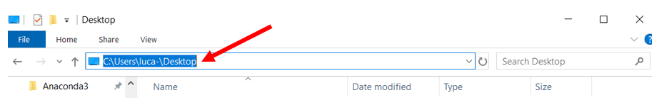

# Toolbox-ARC
A toolbox to process neural data

# Anaconda
Anaconda is an environment manager for Python. We use it to set environments which contain all the needed libraries. This is how to use it:

## 1. Installation
Download Anaconda for the last Python version (3.X) using [THIS LINK](https://www.anaconda.com/distribution/).
Follow the instructions of the .exe file.

## 2. Create environment
### a) From scratch
- Open "Anaconda Prompt".

- Create your environment with the last Python version:
```
conda create -n myenv python=3.X
````
Note: replace "myenv" by the name of your environment (whatever you want) and "X" by the corresponding Python version.

- Activate your environment:
```
conda activate myenv
```
Note: the text (myenv) should appear at the beginning of the new command line.

- Add the libraries you need by typing the corresponding command found in [Anaconda Cloud](https://anaconda.org/anaconda/repo).

Tips: Choose "Anaconda/" option when available.

Example with [scipy](https://anaconda.org/anaconda/scipy):
```
conda install -c anaconda scipy
```

### b) From Yaml file
- Download the Yaml file of the desired environment (desired_env.yml).

- In the Anaconda Prompt, go to the corresponding location.
```
cd PATH_TO_YAML_FILE
```
Note: replace PATH_TO_YAML_FILE with the absolute path of the folder where the desired file is stored.

- Import the environment:
```
conda env create -f desired_env.yml
```
Note: replace "desired_env" by the corresponding environment name.

- Activate your environment:
```
conda activate myenv
```
Note: the text (myenv) should appear at the beginning of the new command line.

## 3. Launch Jupyter Notebook
A Jupyter Notebook is a notebook allowing you to write and run Python code easily using your conda environment.

- While your environment activated, install jupyter library:
```
conda install -c anaconda jupyter
```

- Launch a new notebook:
```
jupyter notebook
```

- A Chrome tab will open, choose the folder where you want your notebook to stand and create a new Python 3 notebook:


# GitHub
GitHub is a platform to share codes.

## Import a repository
Importing a repository allows you to use a shared code in local.

- The first time you use GitHub in your conda environment, you have to install the corresponding library:
```
conda install -c anaconda git
```
- Then, you can import whatever GitHub repository you want:
```
git clone https://github.com/desired_repo
```
Note: the URL is available on the repository website:


## Create a repository
You can share your own code on GitHub to enhance collaborative work.

- Create a [GitHub account](https://github.com/).

- Create a new repository (do not initialize the new repository with README, license, or gitignore files).

- Go to Anaconda Prompt, activate your environment, go to the local folder you want to share:
```
cd PATH_TO_FOLDER
```

- Initialize your local folder as a Git repository:
```
git init
```

- Add all the files locating in the current folder to the git repository you have just created:
```
git add .
```
Note: don't forget the DOT in the command.

- Commit the files (set them to be send online):
```
git commit -m "Message associated with the commit"
```

- Set the remote command (to manage the GitHub repository):
```
git remote add origin repository_URL
git remote -v
```
Note: replace "repository_URL" by the URL found on GitHub


- Put the changes on GitHub (in the master branch):
```
git push origin master
```

# Python
Here are some useful basic commands in Python.

## Import a library
To use a library you have installed on your environment, you have to import it in Python.

For this tutorial, we will take the example of "Numpy" library which is used for matrices manipulation.

- Simple importation:
```
import numpy
```
- It is also possible to rename it for easier usage:
```
import numpy as np
```
- You may want to import only a part of the library (here array is a function of Numpy library):
```
from numpy import array
```

## Comment
- To add a comment, just add the symbol "#" at the beginning of the line (the shortcut ctrl+/ does the same wherever you are on the line)

- To add a title, press "#" when you select the outline of an empty cell (when the selection appears in blue).

Therefore, 3 # should appear in the cell and you can click inside to write your title.

Note: you can add or delete the # to change the size of your title (the more # you introduce, the lower the size).

## Import dataset
To import a dataset, you have to import the library able to read the file and specify the absolute path of the file on your computer:
```
FILE_PATH = "C:\Users\file_location"
```
This path can be found on your file explorer:


Here is the example with an edf file for EEG data (compatible with mne library):
```
import mne
FILE_PATH = "C:\Users\file_location\myfile.edf"
data = mne.io.read_raw_edf(FILE_PATH)
raw_data = data.get_data()
```

## Matrix
Data in Python are considered as matrices, it is thus important to deal with this type of entity.

The main library to work with matrices is "Numpy". This is some interesting commands to know (with the explaining as comment next to):
```
import numpy as np    #import Numpy library
mat = np.array([[1,1,1],[2,2,2]])   #create a matrix called "mat" with 2 rows, 3 columns whose first row is "1 1 1" and second raw "2 2 2"
my_row = mat(0,:)    #put the first row (indixed as 0) of "mat" inside "my_row" (the ":" means that we take all the columns of the desired line)
my_column = mat(:,0)    #put the first column of "mat" inside "my_column"
my_range = np.arange(10)    #Create an vector of 10 integers (from 0 to 9)
my_custom_range = np.arange(3,11,2)   #Create a vector of integers from 3 to 11 by step of 2
my_linear_vec = np.linspace(2,4,10)   #Create a vector of 10 numbers equally spaced from 2 to 10 
```


## Figure
### Pyplot
The reference library to plot figures in Python is Pyplot from Matplotlib. Here are some basic functions.

- Import the library:
```
from matplotlib import pyplot as plt
```
- Plot an image:
```
plt.figure()
plt.imshow(IMAGE_PATH)   #the path can be relative from current folder
plt.show()
```
Note: "plt.figure()" instanciate a window where the figure will be plotted. You have to write this commant each time you want to display a new figure without erasing the previous one.

- Plot a graph:
```
plt.plot([x_coordinates],[y_coordinates])
plt.show()
```
Example:
```
plt.plot([1,2,3],[4,10,6])
plt.show()
```
Note: plt.plot makes a linear interpolation between points.

- Make a scatter plot (no link between points)
```
plt.scatter([x_coordinates],[y_coordinates])
plt.show()
```
- Make a bar plot
```
plt.bar([x_coordinates],[y_coordinates])
plt.show()
```
- Create subfigures (display several graphs on the same figure)
```
fig, axes = plt.subplots(2, 1)    #the main figure is divided in 2 lines and 1 column -> (2,1)
axes[0].plot([x_coordinates],[y_coordinates])   #linear plot on the first line
axes[1].scatter([x_coordinates],[y_coordinates])    #scatter plot on the second line
```

### Seaborn
Seaborn is a library of statistical visualization. Here are some basic functions.

- Import the library and enable color code:
```
import seaborn as sns
sns.set(color_codes=True)
```
- Plot histogram:
```
sns.displot(my_vector)
```
- Plot the approximated distribution:
```
sns.kdeplot(x, shade=True)
```
- Plot the joined distribution on x and y axis:
```
sns.jointplot(x=x_coordinates, y=y_coordinates)
```
- If you have a dataset (e.g. a csv file with a label on each columns), you can make a pairplot to compare the distributions of each features two by two:
```
my_data = sns.load_dataset("PATH_TO_DATASET")
sns.pairplot(my_data)
```
