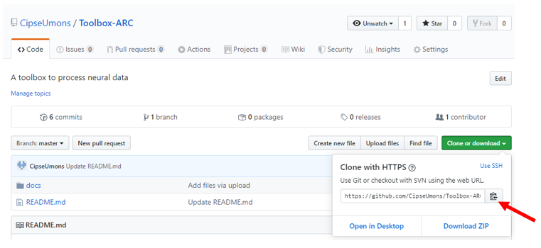

# Toolbox-ARC
A toolbox to process neural data

# Anaconda
Anaconda is an environment manager for Python. We use it to set environments which contain all the needed libraries. This is how to use it:

## 1. Installation
Download Anaconda for the last Python version (3.X) using [THIS LINK](https://www.anaconda.com/distribution/).
Follow the instructions of the .exe file.

## 2. Create environment
### a) From scratch
- Open "Anaconda Prompt".

- Create your environment with the last Python version:
```
conda create -n myenv python=3.X
````
Note: replace "myenv" by the name of your environment (whatever you want) and "X" by the corresponding Python version.

- Activate your environment:
```
conda activate myenv
```
Note: the text (myenv) should appear at the beginning of the new command line.

- Add the libraries you need by typing the corresponding command found in [Anaconda Cloud](https://anaconda.org/anaconda/repo).

Tips: Choose "Anaconda/" option when available.

Example with [scipy](https://anaconda.org/anaconda/scipy):
```
conda install -c anaconda scipy
```

### b) From Yaml file
- Download the Yaml file of the desired environment (desired_env.yml).

- In the Anaconda Prompt, go to the corresponding location.
```
cd PATH_TO_YAML_FILE
```
Note, replace PATH_TO_YAML_FILE with the absolute path of the folder where the desired file is stored.

- Import the environment:
```
conda env create -f desired_env.yml
```
Note: replace "desired_env" by the corresponding environment name.

- Activate your environment:
```
conda activate myenv
```
Note: the text (myenv) should appear at the beginning of the new command line.

## 3. Launch Jupyter Notebook
A Jupyter Notebook is a notebook allowing you to write and run Python code easily using your conda environment.

While your environment activated, launch a new notebook:
```
jupyter notebook
```
A Chrome tab will open, choose the folder where you what your notebook to stand and create a new Python 3 notebook:


# GitHub
GitHub is a platform to share codes.

## Import a repository
Importing a repository allows you to use a shared code in local.

- The first time you use GitHub in your conda environment, you have to install the corresponding library:
```
conda install -c anaconda git
```
- Then, you can import whatever GitHub repository you want:
```
git clone https://github.com/desired_repo
```
Note: the URL is available on the repository website:



## Create a repository
You can share your own code on GitHub to enhance collaborative work.

- Create a [GitHub account](https://github.com/).

- Create a new repository (do not initialize the new repository with README, license, or gitignore files).

- Go to Anaconda Prompt, activate your environment, go to the local folder you want to share:
```
cd PATH_TO_FOLDER
```

- Initialize your local folder as a Git repository:
```
git init
```

- Add all the files locating in the current folder to the git repository you have just created:
```
git add .
```
Note: don't forget the DOT in the command.

- Commit the files (set them to be send online):
```
git commit -m "Message associated with the commit"
```

- Set the remote command (to manage the GitHub repository):
```
git remote add origin repository_URL
git remote -v
```
Note: replace "repository_URL" by the URL found on GitHub


- Put the changes on GitHub (in the master branch):
```
git push origin master
```
